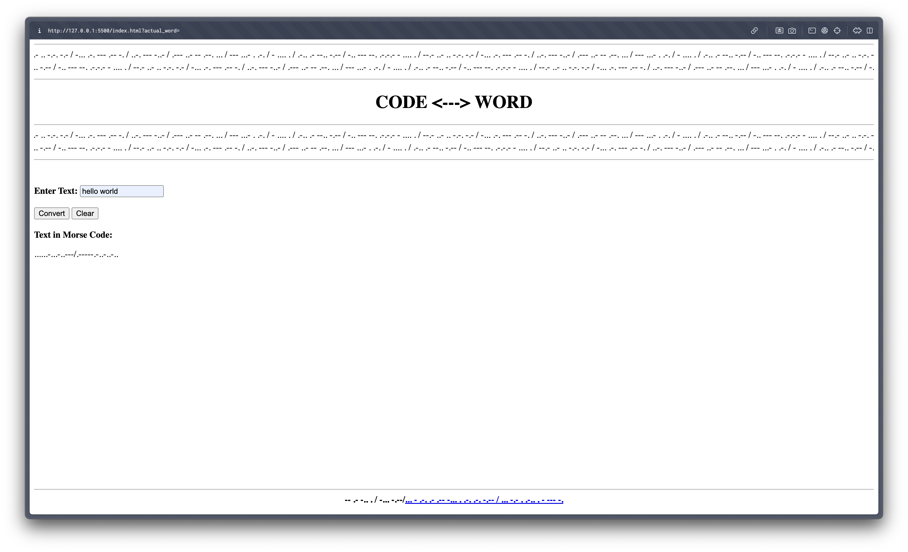

# Code <---> Word

Text to Morse Code translation website.
But there's a twist, no CSS is used.

## Features:
- centered title
- morse code marquee 
- text field for getting input
- submit button (function implemented in JS)
- clear button (function implemented in JS)
- footer with link to github

## Screenshots

## Credits
- made by me
- idea brainstorming help: chatgpt
- mdndocs for marquee tag docs
- morse code translator for translated morse code + creating dictionary